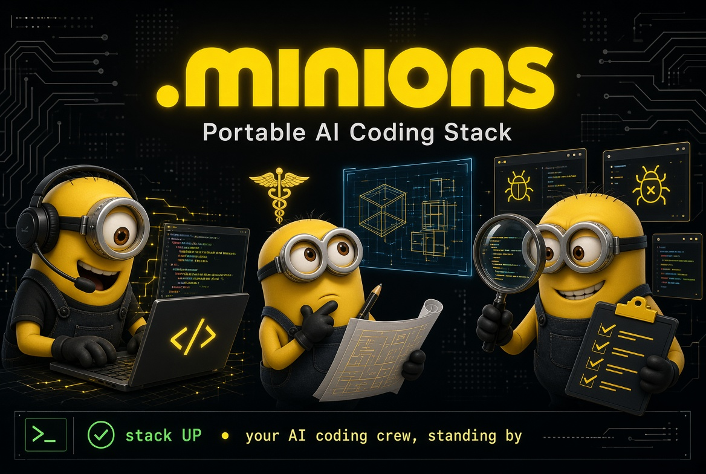

# .minions

> **Portable, oh-my-zsh-style bootstrap for a complete AI coding stack in `~/.minions`.**

<p align="center">
    <picture>
        
    </picture>
</p>

<p align="center">
<a href="https://github.com/gitricko/.minions/actions/workflows/ci.yml">
    
</a>
[](./LICENSE)
[](./install.sh)
[-brightgreen.svg)](#requirements)
[](https://github.com/NousResearch/hermes-agent)
[](https://pi.dev)
[](https://www.npmjs.com/package/modelrelay)
[](https://www.npmjs.com/package/omniroute)
[](https://github.com/ollama/ollama)
[](https://github.com/mnemon-dev/mnemon)
</p>

`.minions` installs and wires a practical local AI toolchain so you can go from zero to productive with one command.

---

## Why `.minions`?

| You want... | `.minions` gives you... |
|---|---|
| Fast setup, no yak-shaving | One installer (`install.sh`) + one runtime entrypoint (`boot.sh`) |
| Free-model routing with OpenAI-compatible APIs | **OmniRoute** (`:20128/v1`) + **ModelRelay** (`:7352/v1`) |
| Agent tooling ready out of the box | **Pi Agent** + **Hermes CLI** preconfigured |
| Durable context across sessions | **Mnemon** installed and seeded |
| Safe, reproducible behavior | Version pins, health checks, PID-based process control |

---

## What gets installed

- **OmniRoute** (persistent proxy)
- **ModelRelay** (persistent proxy)
- **Pi Agent** (CLI)
- **Hermes** (CLI)
- **Mnemon** (memory layer)
- **Skills/Wikis** (Useful skills and llm-wiki)

---

## Quick Start

### Install

```bash
# published installer
curl -fsSL https://github.com/gitricko/.minions/raw/refs/heads/main/install.sh | bash

# or from this repo
./install.sh
```

### Boot

```bash
~/.minions/boot.sh
```

### Verify

```bash
~/.minions/status.sh
```

### Stop

```bash
~/.minions/stop.sh
```

---

## Branch install (PR/dev testing)

```bash
export INSTALL_URL="https://github.com/gitricko/.minions/raw/refs/heads/<branch>/install.sh"
bash -c "$(curl -fsSL "$INSTALL_URL")"
```

Use `bash -c "$(curl ...)"` so environment variables like `HOME` and `INSTALL_URL` are preserved correctly during bootstrap.

---

## Configuration

`.minions` is configurable through environment variables:

```bash
OMNIROUTE_PORT=20128
MODELRELAY_PORT=7352
```

Example custom ports:

```bash
export OMNIROUTE_PORT=20129
export MODELRELAY_PORT=7353
./install.sh
~/.minions/boot.sh
```

---

## Common commands

```bash
~/.minions/boot.sh --doctor   # attempt repair
~/.minions/status.sh          # health + readiness checks
~/.minions/stop.sh            # stop running services
```

---

## Repository layout

```text
.minions/
├── install.sh
├── boot.sh
├── stop.sh
├── status.sh
├── lib/        # install/bootstrap/runtime helpers
├── etc/        # pinned versions + config templates
├── tests/      # shell tests + DTS integration
├── scripts/    # developer utilities
├── skills/     # agent skill content
├── wiki/       # project knowledge content
└── docs/       # implementation history and deep dives
```

---

## Docs worth reading

- [`docs/scout-report-minions-v1.md`](docs/scout-report-minions-v1.md) — full implementation narrative and decisions
- [`docs/IMPLEMENTATION-STATUS.md`](docs/IMPLEMENTATION-STATUS.md) — latest status and verification notes
- [`docs/requirements-research.md`](docs/requirements-research.md) — requirements and early research context

---

## Development & testing

```bash
./tests/test_install.sh
./tests/test_boot.sh
./tests/test_cli_integration.sh
bash tests/test_dts.sh
```

DTS (`tests/test_dts.sh`) is the clean end-to-end path: install → boot → health → chat → stop in a fresh Docker container.

---

## Requirements

- Linux (`x86_64` or `arm64`)
- `bash`
- `curl` or `wget`

The installer handles Node/uv and component installation automatically.

---

## License

MIT
